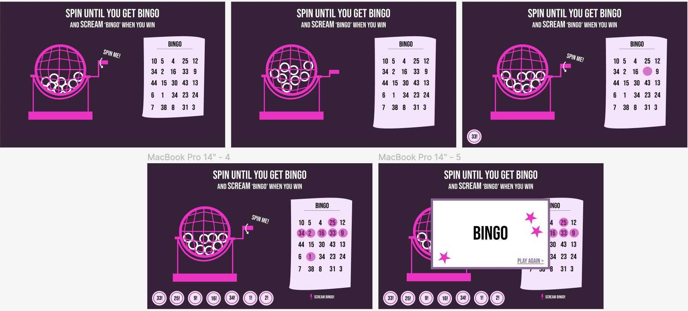
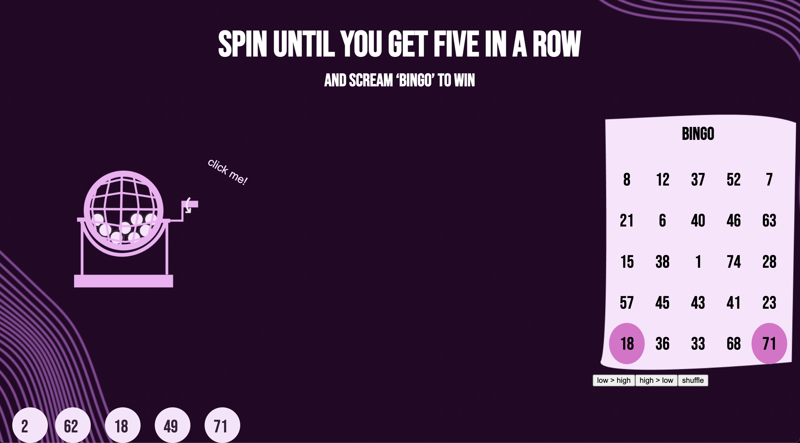
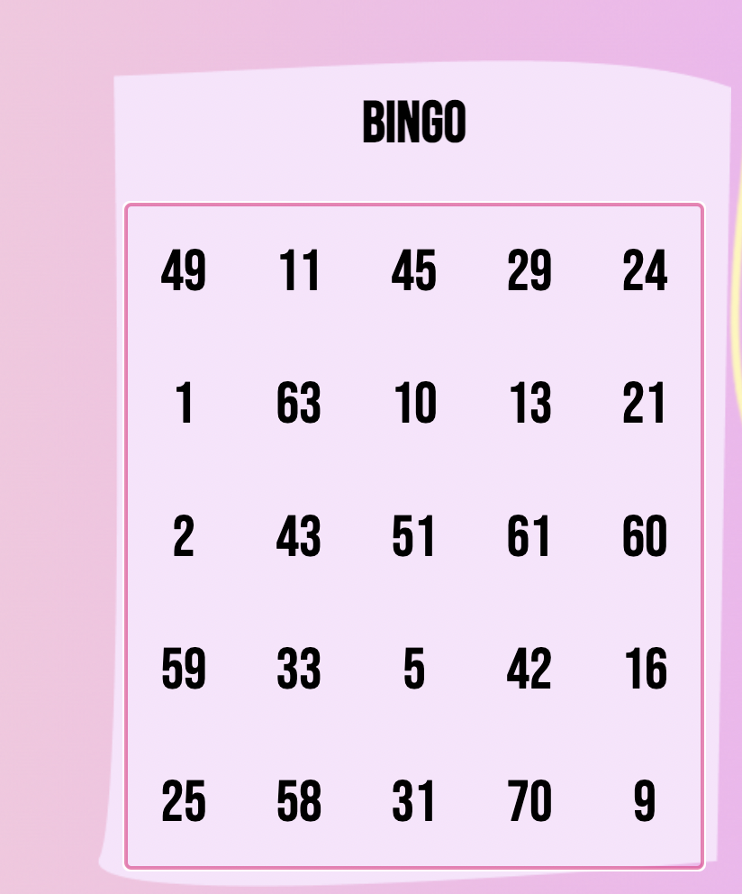

# Procesverslag
**Auteur:** -Nienke Knol-

**De opdrachten:** [opdracht 1](opdracht1/index.html) en [opdracht 2](opdracht2/index.html)

## Bronnenlijst
  1. -https://bennettfeely.com/clippy/-
  2. -https://www.w3schools.com/css/css3_animations.asp-
  3. -https://blog.logrocket.com/css-before-after-custom-animations-transitions/-
  4. -https://moduscreate.com/blog/dark-mode-images/-
  5. -https://developer.mozilla.org/en-US/docs/Web/API/Web_Speech_API-
  6. -https://www.youtube.com/watch?v=SgmNxE9lWcY&t=1136s-

## Opdracht 1 plan

  
Google is een search engine en ik zou graag wat willlen doen met zoekende ogen.

  ### Je storyboard:
  

  ### Je ambitie: 
  Aan deze technieken/punten wil ik werken:
  - Animatie in css
  - Netter in css werken
  - Beter weten wat ik aan het doen ben
  
 

## Opdracht 1 reflectie

  
Ik merkte dat ik het toch best moeilijk vond om meerdere animaties toe te voegen. na het maken van de zoekende ogen liep ik best wat vast

  ### Je uitkomst - karakteristiek screenshot(s):
 
 

  ### Dit ging goed/Heb ik geleerd: 
  het gebruiken van een before en after en hoe je dit bewegend maakt

  

  ### Dit was lastig/Is niet gelukt:
  meerdere animaties toevoegen.

## Opdracht 2 plan

  
Een bingo spel van 75 balletjes waar als je 5 op een rij hebt, je bingo kan roepen en het resultaat dan naar voren komt

  ### Je ontwerp:
  

  ### Je ambitie: 
  Aan deze technieken/punten wil ik werken:
  - Javascript beter begrijpen
  - Weten hoe je met voice kan werken
  - Een echt werkende bingo maken

## Opdracht 2 test

  
De site werkt meerendeels wel maar het was fijn om te zien wat beter kon om het duidelijker te maken

  ### Bevinding 1:
  De sorteer knoppen staan op andere plek als je een ander monitor gebruitk. Zo was het onduidelijk wat deze knoppen betekende.

  #### oplossing:
  dit per min-width aangepast.

  ### Bevinding 2:
  Omdat ik mijn site via github liet zijn waren sommige style onderdelen niet overgenomen zoals de font en de vuurwerk gif op het einde.

  #### oplossing:
  De '/' voor de styling weglaten zodat dit beter mee komt in github.

  ### Bevinding 3:
  De tester heeft niet vaak bingo gespeeld en dacht dat je alle cijfers moet aantikken voor dat je bingo kan roepen. eigenlijk moet dit maar 1 rij van 5 zijn.

  #### oplossing: 
  De h2 veranderen in een tekst die duidelijk maakt wanneer je nou bingo hebt.

 
  ### Bevinding 4:
  De nummers kon je niet aanklikken als je op mobile was omdat de bingo met vuurwerk een z-indez 999 had en dit over alles heen viel.

  #### Oplossing:
  De z-index van de notificatie op -1 gezet wanneer hij nog niet nodig is en dit veranderd naar 999 als het opgeroepen wordt.

  ### Bevinding 5: 
  Het was nog niet helemaal responsive waardoor het er soms slordig uitzag.

  #### Oplossing:
  Dark mode en light mode toegepast, en meer @media min-width toegepast zodat de transition van devices er beter uit zien.

## Opdracht 2 reflectie

  
Met mijn bingo site ben ik eigenlijk best tevereden. In het begin was ik best bang dat het allemaal niet zou werken omdat ik niet wist waar ik moest beginnnen maar uit eindelijk werkt het best goed.

  ### Je uitkomst - karakteristiek screenshot(s):
  
  

  ### Dit ging goed/Heb ik geleerd: 
  Ik heb mezelf uitgedaagt met de javascript om het meerendeels te begrijpen en dit doe ik nu ook. ik ben zeer tevreden dat het bingo aspect werkt en de voice API.

  ### Dit was lastig/Is niet gelukt:
  Het accesible maken vond ik erg moeilijk, het is me niet gelukt om te zorgen dat je door de nummers te kunnen tabben.

  

